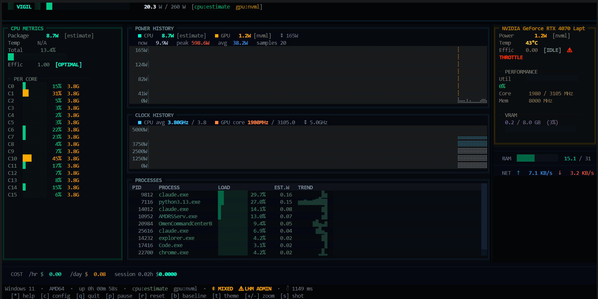

<div align="center">

```
██╗   ██╗██╗ ██████╗ ██╗██╗
██║   ██║██║██╔════╝ ██║██║
██║   ██║██║██║  ███╗██║██║
╚██╗ ██╔╝██║██║   ██║██║██║
 ╚████╔╝ ██║╚██████╔╝██║███████╗
  ╚═══╝  ╚═╝ ╚═════╝ ╚═╝╚══════╝
```

**Real-time terminal power monitor — CPU · GPU · RAM · Network · Processes**

[](https://github.com/GIN-SYSTEMS/vigil-tui/actions)
[](https://www.python.org/)
[](https://github.com/GIN-SYSTEMS/vigil-tui)
[](LICENSE)

</div>

---



---

## What is vigil?

vigil is a high-resolution terminal dashboard that shows **live wattage, thermals, clock speeds, efficiency scores, and electricity cost** for every major component in your system — all inside the terminal with no browser, no background service, no telemetry.

It reads directly from hardware sensors (hwmon, RAPL, LibreHardwareMonitor, NVML) and falls back gracefully when sensors are unavailable. Every panel updates in real time, every metric is timestamped, and the whole thing runs from a single `vigil` command.

---

## Features

### Power & Thermals
- **CPU package power** — hwmon (AMD k10temp / zenpower / amd_energy) → RAPL powercap → LibreHardwareMonitor WMI → CPU% × TDP estimate fallback
- **GPU power** — NVIDIA via NVML: watts, die temperature, utilisation %, core / memory clocks, VRAM, fan speed
- **RAM wattage** — DDR4 power model based on slot count and utilisation
- **Throttle detection** — blinking `THROTTLE` badge when CPU or GPU thermal throttling is detected

### Charts & Visualisation
- **Braille power history chart** — high-resolution CPU + GPU wattage overlay using Unicode Braille characters
- **Clock history chart** — CPU average frequency and GPU core clock over time with boost ceiling marker
- **Per-core CPU bars** — utilisation percentage + live frequency for every core with boost detection

### Process Intelligence
- **Process table** — top processes ranked by estimated wattage contribution
- **Sparkline trends** — mini bar chart showing per-process watt history
- **EST.W column** — estimated watts per process derived from CPU% share of package power

### Efficiency & Cost
- **Efficiency score** — performance-per-watt rating: `OPTIMAL` · `NORMAL` · `LOW EFF` · `THROTTLE`
- **Electricity cost** — ₺/hr, ₺/day, session total with configurable kWh price and currency symbol
- **Baseline mode** — snapshot idle state, then compare live delta against it in real time

### Alerts & Logging
- **Webhook alerts** — HTTP POST to any endpoint when CPU temperature or power threshold is breached
- **Session logging** — optional JSONL tick log (`--log` flag) for offline analysis
- **SVG screenshot** — capture the full dashboard as a vector image with `s`

### Themes & UX
- **TacticalCyberpunk** (dark) — green / amber / cyan on near-black
- **GhostWhite** (light) — high-contrast monochrome
- **Setup wizard** — first-run guided configuration for TDP and kWh price
- **Accent color tweaks** — live recolour via sidebar

---

## Platform Support

| Platform | CPU Power | CPU Temp | GPU Power | GPU Temp |
|---|---|---|---|---|
| **Linux** | hwmon · RAPL · estimate | hwmon | NVML | NVML |
| **Windows 11 / 10** | LibreHardwareMonitor · estimate | LHM | NVML | NVML |
| **macOS** | estimate only | — | NVML (if present) | NVML |

### Windows — accurate CPU readings

On Windows, vigil reads real CPU wattage through **LibreHardwareMonitor** WMI. Without it, vigil falls back to a CPU% × TDP estimate.

1. Download [LibreHardwareMonitor](https://github.com/LibreHardwareMonitor/LibreHardwareMonitor/releases)
2. Run it **as Administrator**
3. Launch vigil — it will detect LHM automatically

---

## Installation

**Requirements:** Python 3.11 or newer

```bash
# Clone the repository
git clone https://github.com/GIN-SYSTEMS/vigil-tui
cd vigil-tui

# Linux / macOS
pip install .

# Windows  (includes WMI + pywin32 for LHM support)
pip install ".[windows]"
```

**Run:**
```bash
vigil           # launch the dashboard
vigil --log     # launch + write JSONL tick log to vigil_YYYYMMDD_HHMMSS.jsonl
vigil --help    # show all options
```

---

## Key Bindings

| Key | Action |
|-----|--------|
| `*` / `?` | Toggle help overlay |
| `q` / Ctrl+C | Quit |
| `p` | Pause / resume live sampling |
| `r` | Reset chart history |
| `+` / `-` | Zoom Y-axis in / out |
| `b` | Snapshot baseline — press again to clear |
| `s` | Save SVG screenshot |
| `t` | Toggle theme (dark ↔ light) |
| `c` | Open config / setup wizard |

---

## Configuration

On first launch, vigil creates `~/.config/vigil/config.toml`:

```toml
[hardware]
cpu_tdp_watts       = 65.0     # CPU TDP ceiling used for estimation
gpu_tdp_watts       = 165.0    # GPU TDP ceiling
update_interval     = 1.0      # seconds between ticks
history_len         = 120      # chart ring-buffer depth (samples)

[cost]
kwh_price           = 2.0      # electricity price per kWh
currency_symbol     = "₺"      # shown in cost display

[alerts]
webhook_url         = ""       # HTTP POST endpoint — leave empty to disable
cpu_temp_thresh     = 90       # °C — triggers webhook alert
cpu_watt_thresh_pct = 90       # % of TDP — triggers webhook alert

[ui]
theme               = "tactical"   # "tactical" or "ghost"
```

Edit it with any text editor. Changes take effect on the next launch.

---

## Project Structure

```
vigil-tui/
├── src/vigil/
│   ├── app.py                   # Textual app, layout engine, tick loop
│   ├── config.py                # Static constants (TDP defaults, etc.)
│   ├── config_manager.py        # TOML config loader / writer
│   ├── session.py               # Cost tracking, webhook alerts, JSONL logging
│   ├── collectors/
│   │   ├── base.py              # Collector ABC + SensorReading dataclass
│   │   ├── cpu.py               # CPU power: hwmon → RAPL → LHM → estimate
│   │   ├── gpu.py               # NVIDIA NVML — full metric suite
│   │   ├── ram.py               # RAM wattage model
│   │   ├── netdisk.py           # Network + disk I/O delta rates
│   │   └── system.py            # Orchestrator → SystemSnapshot
│   └── widgets/
│       ├── power_header.py      # Top bar: wordmark + live gauge
│       ├── cpu_panel.py         # Left: CPU package + per-core bars
│       ├── braille_chart.py     # Center top: Braille power history
│       ├── clock_chart.py       # Center mid: clock history chart
│       ├── process_table.py     # Center bot: process wattage ranking
│       ├── gpu_panel.py         # Right: GPU metrics panel
│       ├── financial_widget.py  # Cost display
│       ├── netdisk_widget.py    # Network + disk rates
│       ├── status_bar.py        # Footer status line
│       ├── boot_screen.py       # Splash / boot animation
│       ├── help_overlay.py      # Key binding overlay
│       └── setup_wizard.py      # First-run config wizard
├── .github/workflows/ci.yml     # CI: import + entry-point check (Linux + Windows)
├── pyproject.toml
├── requirements.txt
└── LICENSE
```

---

## How the power waterfall works

```
vigil starts
│
├─ Linux?
│   ├─ hwmon sysfs (k10temp / zenpower / amd_energy)  ← real sensor, best accuracy
│   ├─ RAPL powercap energy_uj delta                  ← kernel counter, good accuracy
│   └─ CPU% × TDP estimate                            ← always available, rough
│
└─ Windows?
    ├─ LibreHardwareMonitor WMI (Admin required)      ← real sensor, best accuracy
    └─ CPU% × TDP estimate                            ← always available, rough
```

GPU always reads via **NVML** (pynvml). If no NVIDIA GPU is present the panel shows `unavailable` without crashing.

---

## Requirements

| Package | Purpose |
|---------|---------|
| `textual >= 0.80` | TUI framework |
| `psutil >= 5.9.8` | CPU%, process list, network / disk I/O |
| `pynvml >= 11.5.0` | NVIDIA GPU metrics |
| `wmi >= 1.5.1` *(Windows only)* | LibreHardwareMonitor WMI bridge |
| `pywin32 >= 306` *(Windows only)* | Windows COM / WMI support |

---

## License

[MIT](LICENSE) — free to use, modify, and distribute.

---

<div align="center">
built by <a href="https://github.com/GIN-SYSTEMS">GIN-SYSTEMS</a>
</div>
